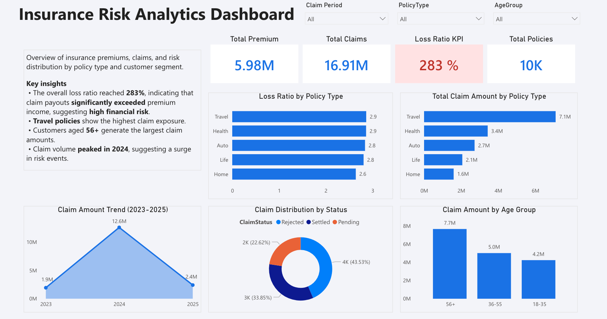

# Insurance Risk Analytics Dashboard
This project analyses insurance policy and claims data to explore risk patterns and claim trends.

## Tools
- SQL Server
- Power BI
- Excel

## Process
Dataset (Excel) → SQL data loading → SQL analysis views → Power BI dashboard

## Dashboard Preview

## Power BI Dashboard
Power BI Link: INSERT_LINK_HERE

## Files
- `loadData.sql` – SQL script for creating tables and loading data  
- `analysis.sql` – SQL scripts for data cleaning and risk analysis views  
- `InsuranceRisk.xlsx` – dataset  
- `InsuranceRiskAnalytics.pbix` – Power BI dashboard
